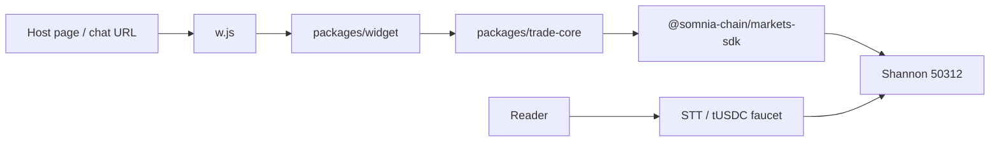
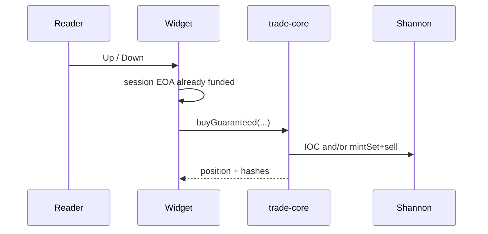
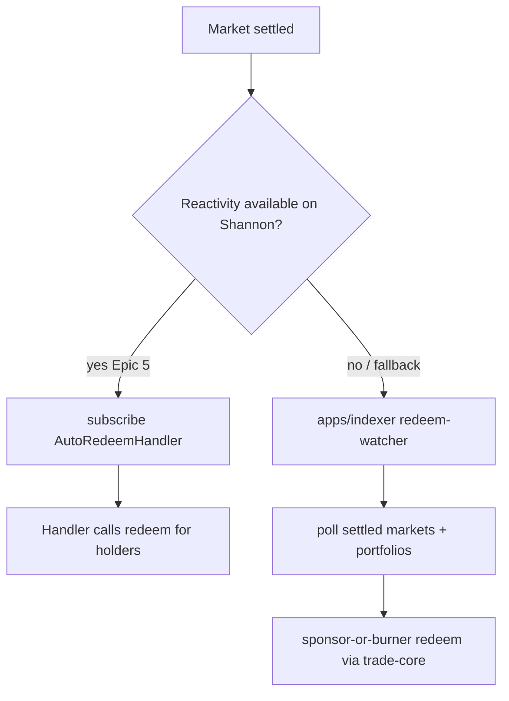

# Anywhere — Architecture

Client-only app on Somnia Shannon (`50312`): `trade-core` + `widget` + host desk. Sponsor payouts and a custom router contract are still later.

## 0. Correct course (2026-09-10)

Shipped path: host drops `w.js` or a `/?host=` URL → session EOA on device → **reader funds** STT + tUSDC → `buyGuaranteed` on Shannon with `userData` = `keccak256("anywhere.v1:" + host)[:8]`. Desk at `/desk/` reads tagged orders from the Somnia Markets indexer.

**Not this build:** `POST /sponsor`, host fee claim, `RouterAttribution.sol`. Diagrams below that still mention those apps describe the **backlog** shape, not what is deployed.

## 1. Paradigm

**Client-signed session trades. No custody backend in MVP.**

- Signing happens in the browser / TMA WebView with a local session EOA.
- Keys never leave the client. There is no sponsor service in production.
- Thin-book fills: `mintSet` + IOC sell of the unwanted leg (`buyGuaranteed`).
- Attribution: `hostId` from query/script/`startapp` is stamped into the order `userData` on Shannon. Local bet records keep a copy. Host desk reads the same tag from the indexer. Fee claim is later.



## 2. Monorepo layout

```
event-contracts-anywhere/
├── pnpm-workspace.yaml
├── package.json                 # scripts: spike:markets, trade:smoke
├── packages/
│   ├── trade-core/              # SDK wrapper — no UI
│   │   ├── src/
│   │   │   ├── env.ts           # NETWORK, chain, RPC, addresses
│   │   │   ├── createExchange.ts
│   │   │   ├── getTradeableMarket.ts
│   │   │   ├── buyGuaranteed.ts # mintSet-garantili-fill
│   │   │   ├── redeem.ts
│   │   │   └── types.ts
│   │   └── scripts/
│   │       ├── spike-markets.ts
│   │       └── smoke-roundtrip.ts
│   ├── widget/                  # React + Vite library + embed
│   │   ├── src/
│   │   │   ├── burner/          # keygen, encrypt, storage adapters
│   │   │   ├── market/          # live odds, book, countdown
│   │   │   ├── trade/           # Up/Down → buyGuaranteed
│   │   │   ├── state/           # idle | open | settled
│   │   │   ├── history/         # localStorage bets
│   │   │   ├── embed/           # postMessage resize
│   │   │   └── App.tsx
│   │   ├── embed/w.js           # <script> injector → iframe
│   │   └── demo/                # fake news article page
│   └── contracts/               # Foundry
│       ├── src/
│       │   ├── RouterAttribution.sol   # Path A only
│       │   └── AutoRedeemHandler.sol   # optional Reactivity
│       ├── test/
│       └── script/Deploy.s.sol
├── apps/
│   ├── sponsor/                 # Hono · POST /sponsor
│   │   └── src/
│   │       ├── index.ts
│   │       ├── fund.ts          # STT + tUSDC transfer
│   │       ├── caps.ts          # address / host-day / IP
│   │       └── store.ts         # funded addresses + counters
│   ├── indexer/                 # Node + viem
│   │   └── src/
│   │       ├── index.ts
│   │       ├── subscribe.ts     # Traded logs OR fill scan
│   │       ├── aggregate.ts     # per-host volume/wallets/fees
│   │       ├── api.ts           # GET /hosts/:id/metrics
│   │       └── db.ts            # SQLite (better-sqlite3)
│   └── dashboard/               # Next.js
│       └── app/
│           ├── page.tsx         # connect → register
│           ├── embed/page.tsx   # snippet + TMA link
│           └── metrics/page.tsx
└── docs/
    ├── prd.md
    ├── architecture.md          # this file
    └── spike.md                 # Epic 1.1 / 1.5 results
```

**Dependency rule:** `widget` → `trade-core` → SDK/viem. Apps may import `trade-core` types only. Contracts are independent; Path A wires `trade-core` to call `routeBuy` instead of direct pool mint.

## 3. Environment (testnet)

| Key | Value |
|---|---|
| `NETWORK` | `testnet` |
| `CHAIN_ID` | `50312` |
| `RPC_HTTP` | `https://dream-rpc.somnia.network` |
| `RPC_WS` | SDK `wsRpcUrl` (Shannon infra WS; set in `env.ts`) |
| `DREAMDEX_REST` | `https://stg.api.dreamdex.io/v0` *(spot/HTTP only — EC writes go through SDK)* |
| `DREAMDEX_WS` | `wss://stg.api.dreamdex.io/v0/ws/public` *(optional; FR11 prefers SDK live watches)* |
| `SDK` | `@somnia-chain/markets-sdk` `^0.29.0` + `viem` `^2` |
| Chain helper | `somniaShannon` + `SOMNIA_TESTNET_ADDRESSES` from SDK |

`trade-core/src/env.ts` is the single source of truth for exchange construction.

## 4. Critical design #1 — Browser SDK + burner key + bundle

### How signing works

SDK supports two write paths:

1. **`privateKey` on `SomniaMarkets` config** (Node / smoke / preferred for burner): local sign, fixed fees, local nonce, `realtime_sendRawTransaction` — one RTT.
2. **`walletClient`** (injected wallet): browser confirm via newHeads.

**MVP choice:** generate a burner EOA in the widget, keep the key **in memory only** after decrypt, pass `privateKey` into `createExchange({ privateKey })`. Never POST the key. Storage:

| Surface | Persist |
|---|---|
| Web embed | `localStorage` ciphertext (WebCrypto AES-GCM; key derived from opaque device salt) |
| Telegram Mini App | `CloudStorage` ciphertext |

NFR2: sponsor/indexer/dashboard receive only `burnerAddress` + `hostId`.

### Bundle strategy (NFR4)

SDK is large (live store + GraphQL + ABIs + optional React/reactivity peers).

| Rule | Detail |
|---|---|
| Import surface | Prefer root `@somnia-chain/markets-sdk` + `/chains`. **Do not** import `/react` unless a hook is required; widget can use plain `watch*` + local state. |
| Code-split | Vite `manualChunks`: `vendor-sdk`, `vendor-viem`. Lazy-load trade path on first Up/Down tap. |
| Peer omit | Do not bundle `@somnia-chain/reactivity` unless Epic 5 Path R ships; mark peer optional / external. |
| Embed | `w.js` is tiny (~2 KB): creates iframe → loads widget URL with `?host=&market=`. Heavy SDK stays inside iframe origin. |
| Budget | First paint shell ≤2 s mid-mobile; SDK chunk may load after shell. Measure with `vite-bundle-visualizer` once. |

### Sequence (funded tap)



First visit: fund screen (copy address → faucet STT → faucet tUSDC) then the sequence above. **No sponsor POST in MVP.**

## 5. Critical design #2 — `mintSet`-garantili-fill (`buyGuaranteed`)

**Module:** `packages/trade-core/src/buyGuaranteed.ts`  
**Goal:** After return, user holds ~`sizeUsdc` notional of the **desired** outcome only; book stays liquid via minted inventory when thin.

### Inputs / outputs

```ts
buyGuaranteed({
  market,          // BinaryMarket + symbols
  side: "up" | "down",
  sizeUsdc: number, // human USDC, presets 1 | 5 | 25
  maxSlippageBps?: number // default 300 (3%)
}): Promise<{
  netSide: "up" | "down";
  netSize: number;
  path: "ioc" | "mint-sell";
  txHashes: `0x${string}`[];
  refundUsdc: number;      // unused collateral / unsold remainder valued in USDC
}>
```

### Algorithm

Constants (tune after spike book observations; defaults for thin EC books):

| Constant | Default | Meaning |
|---|---|---|
| `DEPTH_MULT` | `1.0` | Require ask-side depth ≥ `sizeUsdc * DEPTH_MULT` within slip band |
| `MAX_SLIPPAGE_BPS` | `300` | Max distance from touch for IOC path |
| `IOC_PRICE_PAD` | `+0.02` | Cross touch (DreamDEX recipe); clamp to (0,1) tick grid (SDK ≥0.28) |
| `MIN_FILL_RATIO` | `0.98` | Else treat as thin → mint path |

```
1. Gate: getMarketOnchain(status === Trading); TTL > 60s else switch successor (getTradeableMarket).
2. Read book for Up symbol; derive Down as complement.
3. desiredAskDepth = sum(asks within touch..touch*(1+slip)) for buy-Up
   (mirror for Down via complementary bids/asks).
4. IF desiredAskDepth >= sizeUsdc * DEPTH_MULT:
     createOrder(desiredSymbol, "limit", "buy", sizeUsdc, paddedPrice, { timeInForce: "IOC" })
     IF filledRatio >= MIN_FILL_RATIO → path=ioc; done
     ELSE fall through (partial = thin)
5. mint-sell path:
     a. Ensure tUSDC allowance to binary pool / vault as SDK requires.
     b. mintSet(sizeUsdc) → +size Up AND +size Down.
     c. Sell UNWANTED leg IOC at best bid − pad (or bid-cross); timeInForce IOC.
     d. Accounting:
        - Wanted inventory stays as position.
        - Proceeds from unwanted sell → tUSDC (refund / bankroll).
        - If unwanted IOC partial-fills: remaining unwanted shares are inventory risk;
          MVP: retry once at more aggressive price; if still residual, record
          `refundUsdc` + `residualUnwanted` in result and surface soft warning in UI.
6. Return net position + all tx hashes.
```

**Why mint-then-sell adds book liquidity:** selling the unwanted leg rests inventory into (or crosses) the book; mint consumes collateral 1:1 so directional risk matches a filled buy without requiring a preexisting counterparty of full size.

**Errors:** insufficient balance → typed `InsufficientFunds`; market not trading → `MarketClosed`; both paths fail → `FillFailed` with hashes of attempted txs.

## 6. Critical design #3 — Attribution (Path A vs B)

**Decision gate:** Epic 1.5 (`docs/spike.md`). Until then implement **Path B** in sponsor/indexer (ships without Solidity), keep Path A contract stub ready.

### Path A — `RouterAttribution` (on-chain)

```solidity
// packages/contracts/src/RouterAttribution.sol (sketch)
interface IRouterAttribution {
    event HostRegistered(uint256 indexed hostId, address payout);
    event Traded(address indexed user, uint256 indexed hostId, uint256 size, uint8 side);
    event FeesClaimed(uint256 indexed hostId, uint256 amount);

    function registerHost(address payout) external returns (uint256 hostId);
    function routeBuy(
        uint256 hostId,
        bytes32 marketId,
        uint8 side,          // 0=Up 1=Down
        uint256 sizeUsdc,
        uint256 maxPrice
    ) external returns (uint256 netSize);
    function claimHostFees(uint256 hostId) external;
}
```

**`routeBuy` body (intended):** pull tUSDC from `msg.sender` → mint complete set on pool → IOC/swap unwanted leg → optional `feeBps` to host escrow → transfer wanted shares to user → `emit Traded`.

**Requires spike proof:** binary-pool ABI allows a contract to mint/trade with funder’s collateral (or router holds inventory briefly). If pool binds mint to EOA-only / no operator path → **abort Path A**.

Indexer Path A: subscribe `Traded` from deployed address.

### Path B — Off-chain attribution (default until spike GO)

| Store | Who writes | Schema |
|---|---|---|
| `attributions` | sponsor on first `/sponsor` **or** widget `POST /attr` at burner create | `(burner_addr PK, host_id, created_at, ip_hash)` |
| `fills` | indexer | `(tx_hash, burner_addr, market_id, side, size_usdc, block, settled_pnl)` |
| `host_stats` | aggregate job | `(host_id, volume_usdc, unique_wallets, accrued_fee)` |

Fee accrual MVP: off-chain formula `fee = volume * feeBps / 10_000` (config `HOST_FEE_BPS`, default `50`); payout is manual/demo (claim UI can be stub). Integrity: burner key never leaves client, so map is best-effort; acceptable for testnet demo.

**trade-core binding:**

| Path | Widget trade call |
|---|---|
| A | `trader` / contract `routeBuy` via viem; still wrap result like `buyGuaranteed` |
| B | `buyGuaranteed` direct on pool; attribution row already exists |

## 7. Critical design #4 — Sponsor caps / anti-abuse

**App:** `apps/sponsor` (Hono).  
**Endpoint:** `POST /sponsor` body `{ burnerAddr, hostId }`.

| Cap | Default | Enforcement |
|---|---|---|
| Per address | **1× lifetime** | DB/set of funded addresses; 2nd call → `409` |
| Per host / UTC day | e.g. **50** fundings | counter key `host:{id}:{yyyy-mm-dd}` → `429` |
| Per IP / UTC day | e.g. **10`** | hash IP + day → `429` |
| Per Telegram user | if TMA: `initData` user id, **5 / day** | validate HMAC; else skip |
| Payload | **~0.01–0.05 STT** gas + **1 tUSDC** stake | env `SPONSOR_STT_WEI`, `SPONSOR_USDC` |
| Faucet wallet | hot key in env only on sponsor | never in widget |

**Flow:** check caps → transfer STT → transfer tUSDC → mark funded → optional Path B attribution insert → return hashes. Low faucet balance → `console.error` + still `503`.

No captcha in MVP; caps are the abuse wall (NFR3).

## 8. Critical design #5 — Auto-redeem (Reactivity vs watcher)



| Mode | When | How |
|---|---|---|
| **Reactivity** | Spike 1.5 says Shannon precompile + `@somnia-chain/reactivity` works | Optional `AutoRedeemHandler.sol` subscribed to resolution event; or client `createReactivity(client).watch` triggering `redeem` |
| **Watcher (MVP default)** | Always ship | Indexer (or small cron in same process) lists watched burners / open positions; on `status === Settled`, call `trade-core.redeem` **signed by burner only if key is present** — **problem:** backend has no burner key |

**MVP-safe watcher rule:** Widget keeps a lightweight `SettlementWatch` in-page: while status is `open`, poll/watch market; on settle, call `redeem(market)` with in-memory burner key (FR6 user-action-free within open session). Background redeem for closed tabs = stretch (would need session txs / Reactivity / custodial — out of scope). Indexer logs settle events for dashboard P&L even if redeem happens client-side.

## 9. App responsibilities (thin)

| App | Owns | Does not own |
|---|---|---|
| `sponsor` | funding + caps (+ Path B map write) | trading, keys |
| `indexer` | logs/fills → host metrics API | signing |
| `dashboard` | host register UI, embed snippet, charts | chain writes except register/claim |
| `widget` | UX, burner, trade, local history, client redeem | durable global analytics |

**Host embed snippet:**

```html
<script src="https://<cdn>/w.js" data-host="<hostId>" data-market="BTC"></script>
```

TMA: `t.me/<bot>/app?startapp=<hostId>`.

## 10. Testing & deploy (hackathon)

- One Shannon integration: `fund → buyGuaranteed → wait settle → redeem` (`trade-core` script).
- Foundry tests only if Path A ships.
- Hosting: widget + dashboard → Vercel; sponsor + indexer → Railway.
- No CI.

## 11. Open spikes (blockers)

Record outcomes in `docs/spike.md`. Architecture branches on these three only:

| # | Spike | GO | NO-GO / fallback |
|---|---|---|---|
| **S1** | Live resolving BTC/ETH short-window EC on Shannon (`pnpm spike:markets`) | Build full write path on that series | Read-only mainnet demo + testnet tx stub; or ask Somnia/DreamDEX Telegram |
| **S2** | Contract can mint/trade on funder’s behalf (Epic 1.5 Foundry) | Path A `RouterAttribution` | **Path B** off-chain map (default) |
| **S3** | Reactivity reachable on Shannon | Optional on-chain/client auto-redeem | In-widget settle watch + redeem (ship this first) |

## 12. Build order (maps to epics)

1. S1 → `trade-core` (`createExchange`, `getTradeableMarket`, `buyGuaranteed`, `redeem`) + smoke CLI.  
2. Widget shell + live book + env-key trade → demo page.  
3. Burner + sponsor caps + TMA.  
4. S2 decide A/B → indexer + dashboard.  
5. Stretch: S3 Reactivity, pilot `/stats`, demo video.

---

**Invariants for implementers**

1. Private keys never leave the client.  
2. Every user-facing tap that claims a fill goes through `buyGuaranteed` (or Path A `routeBuy` with identical net effect).  
3. Markets with `<60s` TTL are never traded — successor only.  
4. Sponsor is one-shot per address; caps fail closed (`429`/`409`).  
5. Attribution Path A and B share the same host-facing metrics shape from `apps/indexer`.
